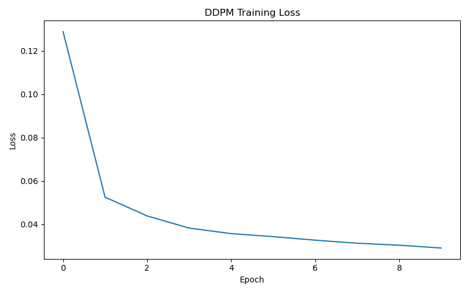
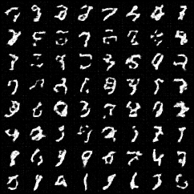
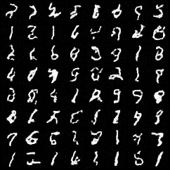
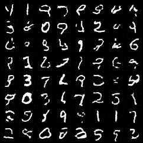
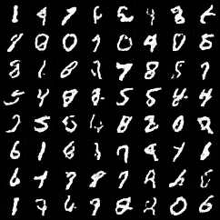
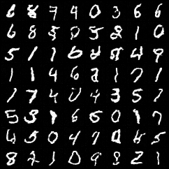
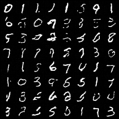

# Week 4 — Denoising Diffusion Probabilistic Models (DDPM) from Scratch

## Overview

This week implements a complete Denoising Diffusion Probabilistic Model (DDPM) following the paper:

> Ho, Jonathan, Ajay Jain, and Pieter Abbeel.
> *Denoising Diffusion Probabilistic Models* (2020)

The goal was to build a diffusion model entirely from scratch, understand the mathematical foundations behind the forward and reverse diffusion processes, and train a model capable of generating MNIST digits from pure Gaussian noise.

Unlike GANs, diffusion models learn generation by gradually reversing a fixed noising process. During training, the model learns how to remove noise from images at arbitrary diffusion timesteps. During sampling, it starts from random noise and repeatedly denoises until a recognizable image emerges.

---

# Project Structure

```text
week4/
├── README.md
├── blocks.py
├── embeddings.py
├── model.py
├── diffusion.py
├── train.py
├── sample.py
├── checkpoints/
│   └── ddpm_mnist.pt
├── results/
│   ├── samples_epoch_10.png
│   ├── samples_epoch_20.png
│   ├── samples_epoch_30.png
│   ├── samples_epoch_40.png
│   ├── samples_epoch_50.png
│   ├── samples_final.png
│   └── loss_curve.png
└── tests/
    ├── test_diffusion.py
    ├── test_ddpm_training.py
    └── test_sampling.py
```

---

# DDPM Intuition

The core idea is surprisingly simple:

1. Take a real image.
2. Gradually add Gaussian noise.
3. Repeat until the image becomes pure noise.
4. Train a neural network to reverse the process.
5. Generate images by starting from noise and repeatedly denoising.

The model never directly learns image generation.

Instead, it learns:

```text
How do I remove noise?
```

Generation emerges naturally from repeatedly applying this denoising operation.

---

# Mathematical Foundations

## Forward Diffusion Process

The forward process gradually corrupts data with Gaussian noise.

For timestep t:

x_t=\sqrt{\bar\alpha_t}x_0+\sqrt{1-\bar\alpha_t}\epsilon

Where:

* x₀ = clean image
* xₜ = noisy image
* ε ~ N(0, I)
* α̅ₜ = cumulative noise schedule

This equation allows sampling any timestep directly without iteratively applying noise.

---

## Noise Schedule

The DDPM paper defines:

\alpha_t = 1-\beta_t

and

\bar\alpha_t=\prod_{s=1}^{t}\alpha_s

This implementation uses a linear beta schedule:

```python
beta = torch.linspace(
    1e-4,
    0.02,
    1000
)
```

This was the original schedule used in the paper.

---

## Training Objective

Instead of predicting images directly, DDPM predicts the noise that was added.

The model learns:

\epsilon_\theta(x_t,t)

Training minimizes:

|\epsilon-\epsilon_\theta(x_t,t)|^2

This is the simplified DDPM objective (L_simple) introduced in Section 3.4 of the paper.

---

## Reverse Diffusion Process

During generation, we start from:

```text
x_T ~ N(0, I)
```

and repeatedly denoise.

The reverse update equation is:

x_{t-1}=\frac{1}{\sqrt{\alpha_t}}\left(x_t-\frac{1-\alpha_t}{\sqrt{1-\bar\alpha_t}}\epsilon_\theta(x_t,t)\right)+\sqrt{\beta_t}z

where:

```text
z ~ N(0,I)
```

except for the final timestep where:

```text
z = 0
```

This corresponds directly to Algorithm 2 in the paper.

---

# Architecture

## Timestep Embeddings

Diffusion models must know how much noise is present.

The timestep:

```text
t
```

is converted into a dense representation using sinusoidal embeddings.

The implementation follows the Transformer positional encoding formulation:

```text
sin(...)
cos(...)
```

followed by an MLP projection.

Pipeline:

```text
t
↓
Sinusoidal Embedding
↓
MLP
↓
t_emb
```

---

## UNet Backbone

The model uses a U-Net architecture.

Encoder:

```text
Input
↓
DoubleConv
↓
Down
↓
Down
↓
Down
```

Decoder:

```text
Up
↓
Up
↓
Up
↓
Output
```

Skip connections preserve spatial information across the network.

---

## Timestep Conditioning

The timestep embedding is injected into every convolutional block.

Inside each DoubleConv block:

```text
Conv
↓
BatchNorm
↓
Add timestep embedding
↓
ReLU
↓
Conv
↓
BatchNorm
↓
ReLU
```

This allows the model to adapt its denoising behavior depending on the current diffusion step.

---

# Design Decisions

## Option A: Internal Timestep Embedding Generation

The final model API is:

```python
pred_noise = model(x, t)
```

instead of:

```python
pred_noise = model(x, t_emb)
```

The model generates embeddings internally.

Advantages:

* Cleaner public API
* Consistent with most modern diffusion implementations
* Simplifies training and sampling loops
* Reduces caller responsibility

---

## Noise Prediction Instead of Mean Prediction

The paper discusses multiple parameterizations:

* Predict μ
* Predict x₀
* Predict ε

This implementation predicts:

```text
ε
```

because:

* Simpler objective
* Better sample quality
* Matches L_simple
* Used in the original DDPM paper

---

## Fixed Variance Schedule

The reverse variance is not learned.

Instead:

```text
σ²_t = β_t
```

This follows the original DDPM setup and keeps the implementation focused on the core algorithm.

---

# Training Pipeline

Algorithm 1 is implemented exactly as described in the paper.

For each batch:

```text
Sample image x₀
↓
Sample timestep t
↓
Generate xₜ
↓
Predict noise
↓
Compute MSE loss
↓
Backpropagation
```

Pseudo-code:

```python
t = diffusion.sample_timesteps(batch_size)

x_t, noise = diffusion.noise_images(
    images,
    t
)

predicted_noise = model(
    x_t,
    t
)

loss = mse(
    predicted_noise,
    noise
)
```

---

# Sampling Pipeline

Algorithm 2 is implemented inside:

```python
Diffusion.sample()
```

Pipeline:

```text
Random Gaussian Noise
↓
DDPM Reverse Process
↓
Generated Digit
```

Pseudo-code:

```python
x = torch.randn(...)

for t in reversed(...):

    predicted_noise = model(x, t)

    x = reverse_update(...)
```

---

# Testing

The implementation includes unit and integration tests.

## Diffusion Tests

Validated:

* Noise schedule generation
* Alpha computation
* Alpha-hat computation
* Timestep sampling
* Forward diffusion

---

## Training Tests

Validated:

* Full DDPM training step
* Loss computation
* Gradient flow
* Backpropagation
* Tensor shape consistency

---

## Sampling Tests

Validated:

* Reverse diffusion execution
* Output dimensions
* Numerical stability
* Absence of NaN values
* Valid output range

---

# Results

## Training Loss



The loss decreases as the network improves its ability to predict injected noise.

---

## Generated Samples

### Epoch 2



### Epoch 4



### Epoch 6



### Epoch 8



### Epoch 10



### Final Samples



---

# Hyperparameters

| Parameter           | Value |
| ------------------- | ----- |
| Dataset             | MNIST |
| Noise Steps         | 1000  |
| Beta Start          | 1e-4  |
| Beta End            | 0.02  |
| Batch Size          | 128   |
| Learning Rate       | 1e-4  |
| Optimizer           | Adam  |
| Embedding Dimension | 256   |
| Base Channels       | 32    |
| Depth               | 3     |
| Activation          | ReLU  |
| Epochs              | 50    |

---

# Key Takeaways

1. Diffusion models learn denoising rather than generation directly.
2. Predicting noise is simpler and more effective than predicting images.
3. Timestep conditioning is essential for successful training.
4. The forward process is fixed; only the reverse process is learned.
5. Repeated denoising transforms Gaussian noise into structured images.

---

# References

1. Ho et al., *Denoising Diffusion Probabilistic Models* (2020)
2. Hugging Face — Annotated Diffusion Model
3. Hugging Face Diffusion Course
4. lucidrains/denoising-diffusion-pytorch
5. Original DDPM paper sections 3.2 and 4

---

# Week 4 Deliverables

* [x] Sinusoidal timestep embeddings integrated into UNet
* [x] Training loop following Algorithm 1
* [x] Sampling loop following Algorithm 2
* [x] Checkpoint saving
* [x] Loss curve generation
* [x] Sample grid generation
* [x] Unit tests
* [x] End-to-end DDPM pipeline
* [x] Recognizable MNIST samples 

This project implements a complete DDPM from scratch using PyTorch and reproduces the core methodology described in the original diffusion paper.
