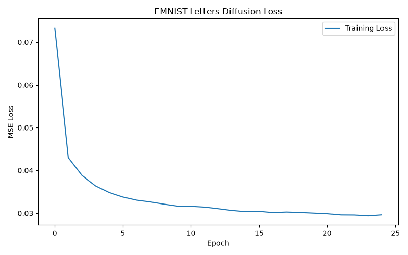
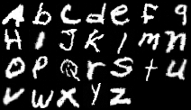

# Diffusion Models from Scratch
## Building a Class-Conditional Image Generator

**Presenter:** Arhan Khade  
**Course:** Seasons of Code 2026  
**Project:** Class-Conditional EMNIST Letters Generator  

<!-- 
Speaker Notes:
"Hello everyone, my name is Arhan, and today I will present my final project for the Seasons of Code program: 'Diffusion Models from Scratch'. Over the past 7 weeks, I built, trained, and optimized a class-conditional generative model from the ground up without using any black-box APIs."
-->

---

## 💡 Project Overview & Motivation

### The Goal
* Demystify generative AI by implementing every component from first principles.
* Move from standard MNIST digits to a larger, more complex dataset of handwritten characters (EMNIST Letters).

### Core Components
* Custom U-Net with skip connections.
* Multi-schedule noise process.
* DDPM & DDIM sampling loops.
* Classifier-Free Guidance (CFG).

<!-- 
Speaker Notes:
"Generative AI is everywhere, but it's often treated as a black box. The goal of this project was to understand the underlying mathematics and architecture. We started with the simple MNIST dataset and eventually graduated to the EMNIST letters dataset, which introduced real-world preprocessing challenges and required building robust data and conditioning pipelines."
-->

---

## 🏗️ Learnings: Building the ML Engine

* **Autograd & Graph:** Deconstructed what happens during `loss.backward()` and how gradients flow through layers.
* **Custom Training Loops:** Bypassed high-level PyTorch Lightning/HF wrappers to write raw PyTorch optimization loops.
* **Hardware Acceleration:** Managed device transfers (`.to(device)`) between CPU, MPS (Apple Silicon), and CUDA.
* **Optimization Dynamics:** Observed convergence differences between SGD and Adam optimizers on pixel-space losses.

<!-- 
Speaker Notes:
"In the first week, we focused on building PyTorch foundations. Understanding autograd, gradient accumulation, and device transfer was crucial. Writing training loops from scratch gave me direct control over optimization dynamics, highlighting why Adam outperforms SGD for complex loss landscapes."
-->

---

## 📐 Learnings: U-Net Convolutional Backbone

### Spatial Dynamics
* **Downsampling:** Encoder blocks compress resolution to extract high-level context.
* **Upsampling:** Decoder blocks reconstruct pixel arrays.
* **Skip Connections:** Concatenate encoder maps to decoder maps.

### The Skip Connection Advantage
* Prevents vanishing gradients across deep convolutional paths.
* Preserves fine-grained pixel coordinates of character strokes.
* **Conditioning:** sinusoidal time embeddings injected before activation.

<!-- 
Speaker Notes:
"For Week 2, we built the U-Net architecture. U-Net is the backbone of diffusion models. Its key feature is skip connections, which bypass bottleneck layers to feed fine-grained spatial information from the encoder directly to the decoder. This prevents the blurry outputs common in simple CNN encoder-decoders."
-->

---

## 🔄 Learnings: The Forward Diffusion Process

* **Closed-Form Sampling:** Sampling $x_t$ directly from $x_0$ at any timestep $t$ using cumulative product coefficients $\bar{\alpha}_t$:
  $$x_t = \sqrt{\bar{\alpha}_t} x_0 + \sqrt{1 - \bar{\alpha}_t} \epsilon \quad \text{where } \epsilon \sim \mathcal{N}(0, I)$$
* **Linear Schedule:** Constant beta values. Fast noise injection, but can destroy early details too aggressively.
* **Cosine Schedule:** Maintains stable signal-to-noise ratio longer, preserving shape structure at lower timesteps.

<!-- 
Speaker Notes:
"Week 3 introduced the forward process—systematically adding noise to an image. The mathematical breakthrough here is that we can jump directly to any timestep $t$ in closed form. We also compared linear and cosine noise schedules, learning that cosine schedules prevent the early, abrupt destruction of image structure."
-->

---

## ↩️ Learnings: The Reverse Process (DDPM)

### Denoising Objective
* The U-Net is trained to **predict the added noise** $\epsilon_t$, not the denoised image $x_0$.
* Time embeddings condition the network at every layer, informing it of the current noise scale.

### Iterative Generation
* Progressive denoising over $T = 1000$ steps.
* Each step subtracts a fraction of the predicted noise and injects standard Gaussian noise to maintain correct variance.

<!-- 
Speaker Notes:
"In Week 4, we implemented the reverse process. Instead of asking the network to paint an image from scratch, we train it to predict the noise vector added at a specific timestep. During sampling, we use that prediction to subtract a fraction of the noise, repeating this iteratively to generate clean samples from pure noise."
-->

---

## ⚡ Implementation: Fast Sampling with DDIM

### DDPM (Stochastic)
* **Sequential Markov Chain:** Must step through all 1000 steps during inference.
* High quality, but slow generation speed.

### DDIM (Deterministic)
* **Non-Markovian Process:** Bypasses sequential step restrictions.
* Allows skipping timesteps (sampling on a sub-sequence).
* **Speedup:** Reduced steps from 1000 to 25–50 with no loss in visual quality.

<!-- 
Speaker Notes:
"Sampling with DDPM is slow because it requires 1000 sequential forward passes. In Week 5, I implemented DDIM sampling. DDIM is deterministic and allows us to skip steps, achieving comparable sample quality in only 25 to 50 steps, representing a 40x speedup."
-->

---

## 🎨 Implementation: Classifier-Free Guidance

* **Class Conditioning:** Added class label embeddings (`nn.Embedding(num_classes + 1, emb_dim)`) to U-Net layers.
* **Joint Training:** Dropped class conditioning with $15\%$ probability to train both unconditional and conditional paths.
* **Guidance Interpolation:** Extrapolating the noise prediction during sampling:
  $$\epsilon_{\text{cfg}} = (1 + w)\epsilon_{\text{cond}} - w\epsilon_{\text{uncond}}$$
* **Scale ($w$):** Balancing letter sharpness (fidelity) and writing style variety (diversity).

<!-- 
Speaker Notes:
"Week 6 was about control: generating the specific letter we want. We implemented Classifier-Free Guidance. By dropping the class labels 15% of the time during training, the network learns to make both conditional and unconditional predictions. We then extrapolate between them using the guidance scale $w$."
-->

---

## 📊 Implementation: EMNIST Letters Pipeline

* **Dataset Scale:** EMNIST Letters split (~124,800 images, $28 \times 28$ grayscale, 26 classes A–Z).
* **Transposition Correction:** Standard EMNIST is stored rotated and mirrored. Corrected in [dataset.py](./dataset.py) using:
  `transforms.Lambda(lambda img: img.transpose(PIL.Image.TRANSPOSE))`
* **Label Alignment:** Shifted 1-indexed EMNIST labels (1–26) to 0-indexed classes (0–25).
* **Geometric Augmentation:** Random rotations ($\pm 10^\circ$) and translations ($10\%$). Flips were disabled to avoid letter corruption (e.g. 'b' to 'd').

<!-- 
Speaker Notes:
"For Week 7, we trained on EMNIST Letters. This introduced data-engineering challenges. EMNIST is stored flipped and rotated, which we had to correct via a custom transposing transform. Furthermore, we had to carefully restrict our data augmentations: horizontal flips were disabled, because a flipped 'd' becomes a 'b', which would confuse the model."
-->

---

## ⚙️ Implementation: Training Run Specifications

### Hyperparameters
* **Epochs:** 25
* **Batch Size:** 128
* **Learning Rate:** 1e-4 (Adam)
* **Base Channels:** 64
* **U-Net Depth:** 3
* **Timestep Embeddings:** 256

### Run Details
* Trained on a remote GPU machine (conda `llmboi` environment).
* **Robust Logging:** Logs saved locally to `results/experiment_log.csv` and synced programmatically to Weights & Biases.

<!-- 
Speaker Notes:
"The model was trained locally on a remote GPU server. We ran for 25 epochs using a batch size of 128 and an Adam optimizer at a learning rate of 1e-4. Training metrics and sample images were logged locally to a CSV file and synced to Weights & Biases."
-->

---

## 📈 Results: Training Loss Curves

### Loss History
* Steady, smooth MSE loss decay indicating consistent training.
* Stabilized around **0.034** after epoch 5.
* Training log: [experiment_log.csv](./results/experiment_log.csv)

### Training Progress

<!-- 
Speaker Notes:
"This slide displays our training curves. The MSE loss decreased steadily and stabilized at around 0.034. Because we used a learning rate of 1e-4 and a batch size of 128, the training process was highly stable, with no divergence issues."
-->

---

## 🏆 Results: Generated Letter Grid (Epoch 25)

### Model Achievements
* Successfully generated readable shapes for characters A–Z.
* Reconstructed clean glyph boundaries.
* Preserved standard handwriting structure.
* Output reference: [samples_epoch_25.png](./results/samples_epoch_25.png)

### Generative Gallery

<!-- 
Speaker Notes:
"This slide displays our generated samples at Epoch 25. The model successfully learned to write letters A through Z. The letters are legible, showing that class-conditioning successfully steers the generation toward distinct characters."
-->

---

## 🔍 Results: Guidance Scale Analysis

* **$w = 0.0$ (Unconditional):** Generates blurry, unstructured letter-like shapes without adhering to a specific target class.
* **$w = 1.0$ (Weak Guidance):** Identifiable letters, but stroke lines are soft and have high geometric variance.
* **$w = 3.0$ (Sweet Spot):** Sharp, highly legible character margins and consistent pen strokes.
* **$w \ge 5.0$ (Over-guidance):** Saturates pixel values, creating thick, high-contrast, bold letters.

<!-- 
Speaker Notes:
"Here, we analyze the impact of the guidance scale $w$. At $w=0$, the output is highly diverse but blurry. As we increase guidance to 3.0, the letters sharpen and align perfectly with their classes. At higher guidance values like 5.0, the lines thicken and become highly saturated, demonstrating the classic fidelity-diversity trade-off."
-->

---

## 🚀 Future: Distributed Compute & Deeper Models

### 1. Scaling Compute
* **PyTorch DDP:** Implement Distributed Data Parallel to train across multi-GPU setups.
* **EMA Logging:** Add Exponential Moving Average of model weights to smooth generated letter margins.

### 2. Modern Architectures
* **Bottleneck Attention:** Add self-attention blocks in the bottleneck to capture global stroke coordination.
* **Diffusion Transformers (DiT):** Replace convolutional U-Net with a ViT-based backbone.

<!-- 
Speaker Notes:
"Looking forward, the first path to improvement is scaling the model and compute. We can implement PyTorch's Distributed Data Parallel to scale training across multiple GPUs. Additionally, replacing the U-Net convolutional backbone with a Diffusion Transformer, or DiT, would allow the model to scale its parameters more efficiently."
-->

---

## 🎨 Future: Latent Space & Text Prompting

* **Latent Diffusion (LDM):** Train an Autoencoder (VAE) to compress images into a low-dimensional latent space. Conduct diffusion in the latent space to dramatically reduce compute requirements (like Stable Diffusion).
* **Text-to-Image (CLIP):** Replace class categorical embeddings with contextual text embeddings from a pre-trained CLIP text encoder to support full descriptive prompts.

<!-- 
Speaker Notes:
"The second path is architectural complexity. Pixel-space diffusion is computationally expensive for high-resolution images. Moving to Latent Diffusion, where diffusion is performed in a compressed latent space, would speed up training. We can also swap our simple class embeddings for CLIP text embeddings to enable descriptive text prompts."
-->

---

## 💬 Reflections & Course Feedback

* **Hands-on Philosophy:** Writing training loops, UNet blocks, and schedules from scratch is vastly superior to importing libraries—it builds deep intuition.
* **Milestone Structure:** Weekly check-ins and clean assignments provided steady, manageable progression.
* **Recommendations:** Keep the "from first principles" approach; it demystifies complex ML research papers.

***Thank you! Questions?***

<!-- 
Speaker Notes:
"To wrap up, I want to thank the Seasons of Code mentors. Implementing a complex architecture like diffusion from scratch was challenging but incredibly rewarding. It demystified modern generative models and gave me deep confidence in building and debugging PyTorch systems. I highly recommend keeping this hands-on, first-principles approach for future cohorts. Thank you, and I am happy to take any questions."
-->
